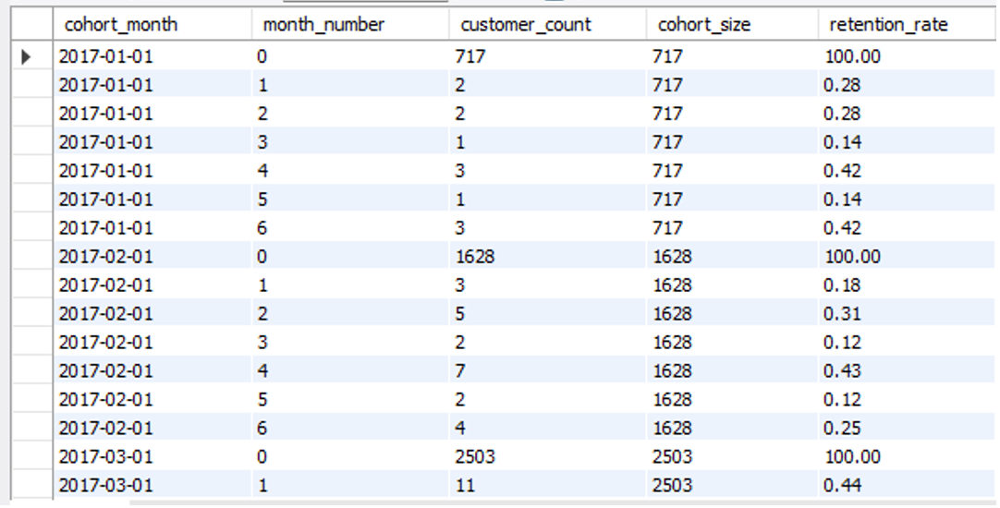

<h1 align="center">Customer Retention Cohort Analysis</h1>

<p align="center">
  <b>Pure SQL | Olist Brazilian E-Commerce Dataset</b><br>
  <sub>Cohort retention analysis using MySQL, CTEs, recursive CTEs, and churn calculations</sub>
</p>

<p align="center">
  
  
  
</p>

---

## The Short Version

98–99% of customers on this platform never come back after their first purchase.

That means for every 1,000 customers acquired, roughly 980 buy once and disappear. The business is spending money to acquire customers it cannot retain — and the data shows this pattern is consistent across every single cohort, every month, for two years.

This is not a traffic problem. It is a retention problem — and fixing it matters far more than acquiring more new customers.

---

## The Core Business Problem

The 2017-02 cohort had 1,628 customers at Month 0. By Month 1, only 3 came back. That is 0.18% retention.

This pattern repeats across every cohort in the dataset. Cohort size does not matter — small cohorts and large cohorts both show the same near-zero retention after Month 1. This means increasing acquisition spend will not fix the revenue problem. It just brings in more one-time buyers.

Using a conservative average order value of $100 — if even 2% of the 98% who never return could be converted into repeat buyers, that represents approximately **$3,200 in additional revenue per 1,000 customers acquired**. At the scale of this platform, that number is significant.

The data is clear: the highest ROI action available to this business is improving Month 1 retention — not growing the top of the funnel.

---

## What the Numbers Show

**Overall retention pattern across all cohorts:**

| Month | Typical Retention Rate | What It Means |
|---|---|---|
| Month 0 | 100% | First purchase — baseline |
| Month 1 | 0.18% – 0.5% | Immediate collapse — nearly everyone is gone |
| Month 2–6 | Below 1% | Stays flat at near-zero |
| Month 7–20 | Trace levels | Small group of long-term buyers remains |

**Example — 2017-01 cohort:**
- 717 customers made their first purchase
- By Month 1: only 2 returned (0.28% retention)
- By Month 6: trace activity only

**Example — 2017-02 cohort:**
- 1,628 customers at Month 0
- By Month 1: 3 returned (0.18% retention)

---

## Four Key Findings

**Finding 1 — The drop happens immediately**

Retention does not decline gradually. It collapses right after Month 0. There is no slow fade — customers buy once and stop. This points to a problem in the post-purchase experience, not product quality or pricing.

**Finding 2 — Retention stays below 1–2% permanently**

After the Month 1 collapse, retention never recovers. It stays below 1–2% for every cohort across the entire two-year period. This is not seasonal. It is structural.

**Finding 3 — Cohort size makes no difference**

Large cohorts and small cohorts show identical retention patterns. Months where the platform acquired more customers did not produce better retention. More acquisition without better retention just means more one-time buyers at higher cost.

**Finding 4 — A small group of loyal buyers exists**

A small number of customers continue purchasing for 10–20 months. These long-tail customers represent the highest lifetime value segment in the entire dataset. They are rare — but they exist, which means repeat purchasing is possible for this business.

---

## Cohort Retention Matrix

<p align="center">
  
</p>

**How to read this table:**
- Rows = cohort month (when the customer made their first purchase)
- Columns = months since first purchase (Month 0 = first purchase, Month 1 = one month later, etc.)
- Values = number of customers from that cohort who returned in that month

The near-empty columns after Month 0 tell the entire story.

---

## What Should Be Done

The problem is specific and the fixes should be too.

| Problem | Action | Expected Impact |
|---|---|---|
| 98% of customers never return after Month 0 | Launch a post-purchase email sequence within 7 days of first order — discount, reminder, or personalised recommendation | Even a 1% improvement in Month 1 retention = ~10 additional repeat buyers per 1,000 customers acquired |
| No incentive structure for repeat buying | Build a simple loyalty program — points, cashback, or next-order discount for customers who buy within 30 days | Targets the window where customers are most likely to return — immediately after first purchase |
| Long-term buyers are not identified or rewarded | Segment the long-tail buyers (10+ months active) and treat them as a separate high-value group | This group already demonstrates repeat behaviour — nurturing them costs less than acquiring new customers |
| Acquisition spend is not matched by retention | Shift budget allocation — reduce paid acquisition spend and redirect toward retention campaigns | High acquisition with near-zero retention is the most expensive growth strategy possible |

**Priority: Fix Month 1 first. Everything else is secondary.**

If the business improves Month 1 retention from 0.3% to even 2–3%, the compounding effect across all cohorts produces significantly more revenue than the same budget spent on new customer acquisition.

---

## How This Was Built

**Step 1 — Data filtering**
Only delivered orders were included. Cancelled and incomplete orders were excluded to ensure only valid transactions were analysed.

**Step 2 — Cohort creation**
Each customer's first purchase month was identified. Customers were grouped into cohorts by that month.

**Step 3 — Activity tracking**
All purchases were mapped to monthly buckets. The time between a customer's first purchase and each subsequent purchase was calculated as a month number (Month 0, Month 1, Month 2, etc.).

**Step 4 — Retention calculation**
For each cohort and month, the number of returning customers was counted and expressed as a percentage of the original cohort size.

---

## SQL Techniques Used

| Technique | Why It Was Used |
|---|---|
| **CTEs** | Broke the logic into clean, readable steps instead of nested subqueries |
| **Recursive CTEs** | Generated month numbers dynamically — the analysis adapts automatically if the date range changes |
| **TIMESTAMPDIFF** | Calculated the exact month difference between first purchase and each subsequent order |
| **CROSS JOIN** | Ensured every cohort-month combination appears in output, including months with zero returning customers |
| **COUNT(DISTINCT)** | Avoided double-counting customers who placed multiple orders in the same month |

---

## Dataset

- **Source:** [Olist Brazilian E-Commerce Dataset](https://www.kaggle.com/datasets/olistbr/brazilian-ecommerce) (Kaggle)
- **Period:** September 2016 – October 2018
- **Tables used:** `customers`, `orders`, `order_items`

| Table | Purpose |
|---|---|
| `customers` | Unique customer identifiers for tracking repeat purchases |
| `orders` | Order timestamps and delivery status |
| `order_items` | Item price and shipping cost per order |

---

## Project Structure

```
/project-root
├── 01_data_setup.sql                          ← Database creation, schema, data import
├── 02_customer_retention_cohort_analysis.sql  ← Main analysis: cohort, retention, churn
├── 03_validation.sql                          ← Data integrity checks
└── README.md                                  ← You are reading this
```

---

## Conclusion

This platform is operating as a one-time purchase business while being priced and structured as an e-commerce business.

98–99% of customers leave after their first order. The pattern is consistent across every cohort for two years. Cohort size does not change it. Season does not change it. It is structural.

The only path to sustainable revenue growth here is retention — specifically, converting more first-time buyers into second-time buyers within the first 30 days. That single improvement, even at a small scale, has a higher return than any amount of additional acquisition spend.

This analysis shows that the problem is not how many customers are coming in. It is how few are staying.

---

## Author

**Ashish Kumar Dongre**

🔗 [LinkedIn](https://www.linkedin.com/in/ashish-kumar-dongre-742a6217b/) &nbsp;|&nbsp; 💻 [GitHub](https://github.com/analytics-ak) &nbsp;|&nbsp; 📂 [Dataset on Kaggle](https://www.kaggle.com/datasets/olistbr/brazilian-ecommerce)
